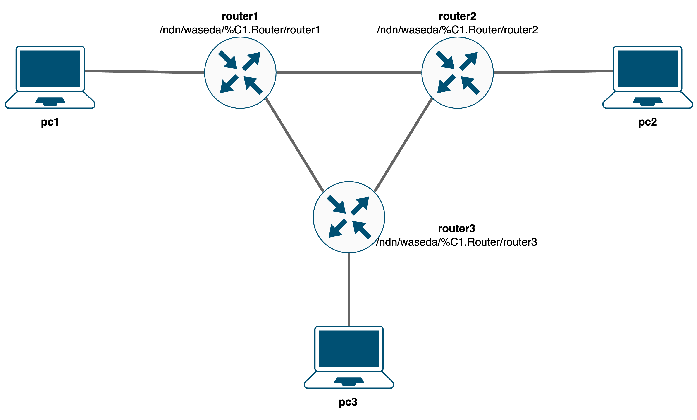

# ndn3-test

## Overview
This repository provides a docker-compose project for setting up a NDN network.
The network consists of 3 NFDs and 3 client nodes.



## Deploy
### 1. Clone the repository
```bash
git clone https://hydrokhoos/ndn3-test.git
cd ndn3-test
```

### 2. Deploy containers using Docker-compose
```bash
docker-compose up -d
```

### 3. Check logs and NLSR status
```bash
docker logs router1
docker logs pc1
docker exec router1 nlsrc status
```

## Usage 1
### Retrieve content
```bash
docker exec pc1 ndnpeek -pf /pc2
# Hello, my name is pc2.
```

## Usage 2
### 1. Add contents
```bash
docker exec -it pc1 bash
./pub_contents.sh
```

### 2. Find provider and peer
```bash
docker exec -it pc2 bash
./get_peerids.sh
```

### 3. Check results
Measurement results are saved in ```pc2:/ndn-find-provs-peer.csv```
```bash
docker cp pc2:/ndn-find-provs-peer.csv .
```

## Destroy
```bash
docker-compose down -v
```
